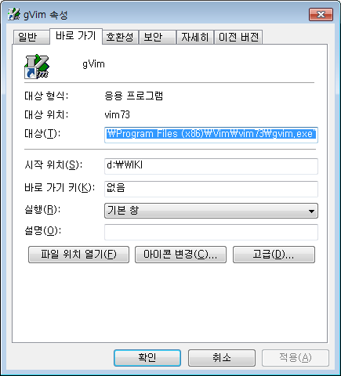

Windows에 설치된 Gvim을 메뉴에서 실행하게 되면 기본 저장 위치는 gvim이 시작된 위치로 저장됩니다.
예를 들면 `:w test.md`라고 명령을 주는 경우에 내 PC의 경우에는 c:\windows\system 폴더에 test.md 파일이 저장이 됩니다.

이것을 해결하기 위해서는 메뉴에 있는 gvim icon에서 오른쪽 마우스버튼을 눌러 속성창을 띄우고 나서 `시작 위치(S):`에 자신이 원하는 디렉토리를 아래처럼 추가 시켜주면 됩니다.

