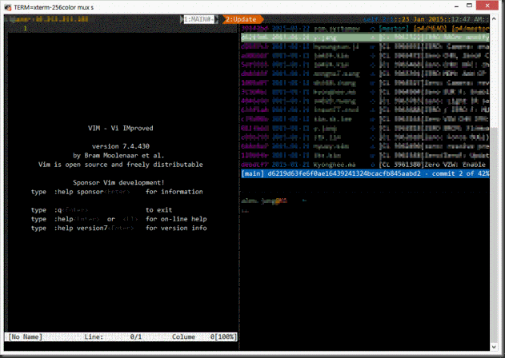
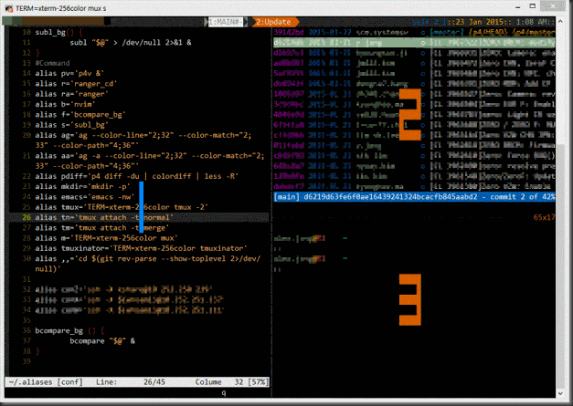

TMX는 terminal multiplexer로 터미널에서 사용하는 프로그램들을 손쉽게 switch하거나 backgroud로 수행할 수 있게 도와주는 툴입니다.

TMUX를 사용하면

1. 터미널창을 분할해서 사용할 수 있습니다. (위 그림에서는 왼쪽에는 VI, 오른쪽 위는 TIG, 오른쪽 아래는 Shell로 분할했습니다.)
2. Perforce Sync / 모델 빌드를 걸어두고 다음날 출근해서 확인할 수 있습니다. (session유지)
  

## 설치방법

### TMUX최신 버전을 설치합니다.
(`apt-get install tmux`로도 설치가능하지만 굉장히 오래전 버전입니다...)

```
To get and build the latest from version control:
$ git clone git://git.code.sf.net/p/tmux/tmux-code tmux
$ cd tmux
$ sh autogen.sh
$ ./configure && make
```

Root권한이 있는 사용자라면 `sudo make install`로 모든 사용자가 해당 버전을 사용하게끔해 줄 수 있습니다.
제가 설정해둔 설정파일을 사용하시면 좀 더 편할 듯싶습니다.

`~/.tmux.conf`로 저장하시면 됩니다.

VI의 color scheme이 정상적으로 동작하게끔하기 위해서 .bashrc 등에 아래 줄을 추가해둡니다.
`alias tmux='TERM=xterm-256color tmux -2'`

## 사용방법

제 설정파일(설정파일은 포스팅 마지막에 있습니다.)을 적용했다고 가정하고 사용법을 설명드리도록 하겠습니다.
기본적인 invoke키는 `Ctrl+b`이지만 저는 ``Ctrl+j``로 변경해두었습니다.

#### 시작하기

`tmux` 혹은 `tmux new -s <원하는 이름>`
: 추후에 attache(재사용)을 하기 편하게끔 이름을 지정하시는게 좋습니다. `tmux new -s normal`

#### 창 분할하기

`Ctrl+j`를 누른 후에 | 를 누르면 좌우로 분할되고,
`Ctrl+j`를 누른 후에 - 를 누르면 상하로 분할됩니다.

#### 창 이동하기

`Ctrl+j`를 누르고 다시 `Ctrl+j`를 누르면 이전 창으로 돌아갑니다.
`Ctrl+j`를 누르고 `q`를 누르면 창마다 숫자가 나오는데 이 때 해당 숫자를 누르면 그 창으로 이동합니다.


#### Tab 만들기

`Ctrl+j`를 누른 후에 `c`를 누르면 새로운 tab이 생성됩니다.

#### Tab간 이동하기

`Ctrl+j`를 누른 후에 `n`을 누르면 다음 tab으로 이동합니다.
`Alt+<숫자키>`를 누르면 해당 tab으로 이동합니다.

#### 창 닫기

shell에서 exit명령을 입력합니다.
`Ctrl+j`를 누른 후에 `x`를 누르면 해당 pane을 닫을 것인지 묻습니다. 이 때 `y`를 선택하면 해당 창이 닫힙니다.

#### Detache / Attache 사용하기 (build걸고 퇴근하기)

tmux를 실행하고 나서 빌드를 실행합니다.
`Ctrl+j`를 누르고 `d`를 누르면 [detached (from session xxx)] 라고 뜨면서 tmux를 실행하기 전 Shell로 빠져나옵니다.
퇴근합니다.~
다음날 와서 `tmux attach -t xxx`를 치면 퇴근 전 화면으로 돌아갑니다.

#### Zoom기능 사용하기

tmux최신버전에는 zoom이라는 기능이 있습니다. 창을 분할해서 사용하다가 잠시 전체 화면으로 바꾸고, 다시 원래대로 돌아갈 수 있는 기능입니다.
`Ctrl+j`를 누른 후에 `z`를 누르면 현재 커서가 위차한 창이 전체 화면으로 전환되고, 다시 `Ctrl+j`를 누른 후에 `z`를 누르면 분할되었던 상태로 돌아가게 됩니다.

## More

### 제 설정에는 bash대신 zsh가 tmux로 접속하면 실행되게 되어 있습니다.
해당 설정을 원래대로 bash로 변경하고 싶으시면 `~/.tmux.conf`에서

```
     # set-option -g default-command "bash"
     set-option -g default-command "zsh"
```

zsh 부부분을 주석처리하시고 bash부분을 주석해제 해주시면 됩니다. (#은 주석처리입니다.)

* tmux에 간단한 설명은 아래를 참고하세요.
   * http://nodeqa.com/nodejs_ref/99
* 매번 tmux를 설정하고 창을 분할하는 작업을 하게 되는데 이걸 미리 설정해서 할 수 있는 Tool도 있습니다.
   * https://github.com/tmuxinator/tmuxinator
   * 저도 설정해서 쓰고 있는데 mux session-name으로 간단히 new/attache를 할 수 있어서 편합니다.

## .tmux.conf
`.tmumx.conf`파일입니다. 아래 파일을 `~/.tmux.conf`로 저장하시면 됩니다.

<script src="https://gist.github.com/code4rain/374c53829bea88cbe328.js"></script>
